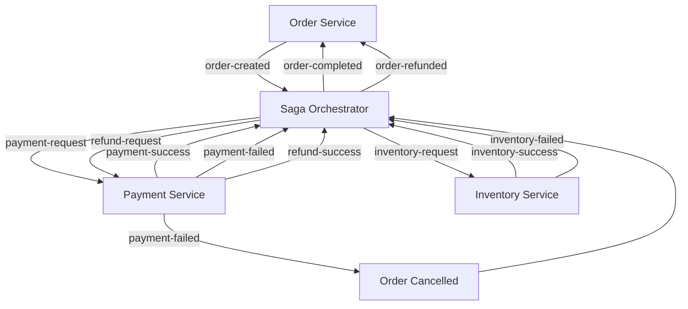

# Distributed Transaction System using Saga Pattern

This project demonstrates a distributed transaction system using the **Saga Pattern** with event-driven microservices.

It ensures data consistency across multiple services without using traditional distributed transactions.

---


---
## 🔄 Event Topics Used
- order-created
- payment-request
- payment-success / payment-failed
- inventory-request
- inventory-success / inventory-failed
- refund-request
- refund-success
- order-completed
- order-refunded

## 🔄 Flow

1. User creates an order via Order Service
2. Order Service publishes `order-created` event
3. Saga Orchestrator listens and triggers Payment
4. Payment Service processes payment:
   - Success → Inventory check
   - Failure → Order cancelled
5. Inventory Service processes stock:
   - Success → Order completed
   - Failure → Refund triggered
6. Refund Service completes compensation if needed
7. Final status is updated in Order DB

---

## ⚙️ Tech Stack

- Java (Spring Boot)
- Apache Kafka
- PostgreSQL
- Docker & Docker Compose

---

## 🔥 Features

- Saga Orchestration Pattern
- Event-driven architecture using Kafka
- Compensation logic (refund flow)
- Idempotent consumers
- Dead Letter Queue (DLQ) handling
- Correlation ID for end-to-end tracing
- Enum-based state management
- Fully Dockerized microservices

---

## 🚀 How to Run

### 1. Clone repository

```bash
git clone https://github.com/RehanKhatkar/distributed-transaction-system.git
cd distributed-transaction-system
```
### 2. Build all services

```bash
cd order-service && ./mvnw clean package
cd ../saga-orchestrator && ./mvnw clean package
cd ../payment-service && ./mvnw clean package
cd ../inventory-service && ./mvnw clean package
cd ..
```
### 3. Run using Docker
```bash
docker-compose up --build
```

### 4. Test API
POST request:
```bash
http://localhost:8081/order
```
Body:
```json
  {
  "userId": 1,
  "productId": 101
  }
```
## 📊 Example Flow (Logs)
```bash
[abc-123] Order created
[abc-123] Payment success
[abc-123] Inventory failed
[abc-123] Refund success
[abc-123] Order refunded
```
## 🧠 Key Concepts
- Saga Pattern: Manages distributed transactions using events
- Event-driven architecture: Services communicate via Kafka
- Compensation: Undo operations when failures occur
- Correlation ID: Tracks a request across multiple services

## 📌 Future Improvements
- Shared event module across services
- Retry mechanisms with backoff
- Monitoring (Prometheus + Grafana)
- API Gateway integration

## 👨‍💻 Author
Rehan Khatkar
